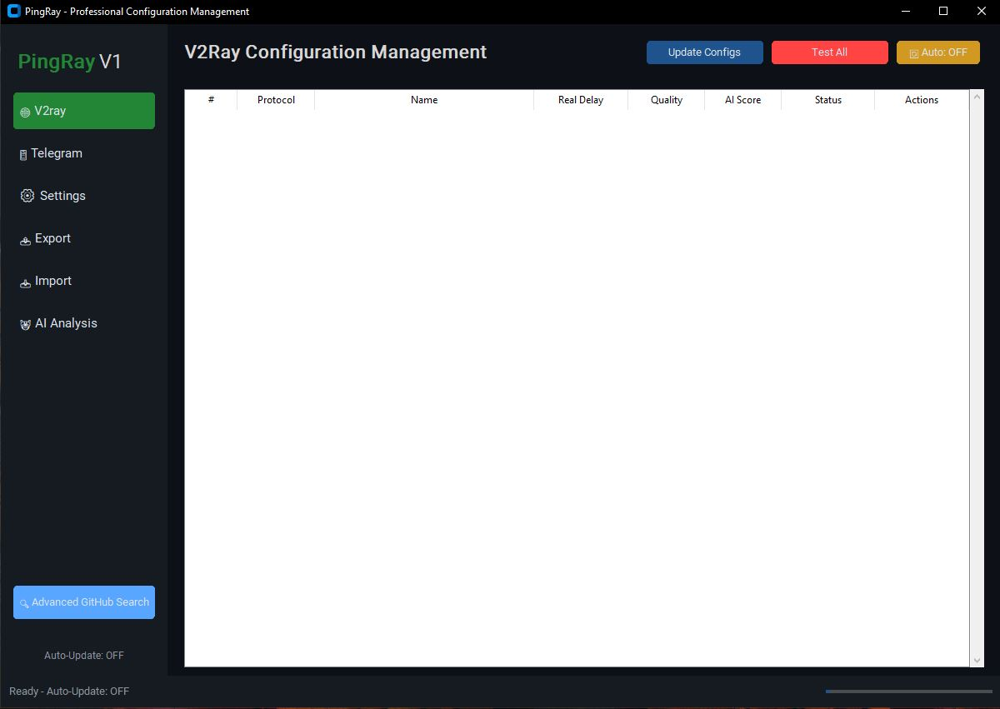

# 🌟 PingRay - VPN Config Management  🌟


Welcome to the boundless world of the internet! **PingRay** is a revolutionary and intelligent software that elevates V2Ray and VPN configuration management to new heights. With its stunning dark-themed interface and a wealth of powerful features, this tool is your ultimate companion for a secure, fast, and enjoyable web experience.

## 🎆 Extraordinary Features

This software is packed with incredible features designed to simplify and enhance your VPN experience. Here’s a detailed look at what it does:

- **Stunning Automated GitHub Search**: Connects to 12 trusted global sources (e.g., MatinGhanbari, Epodonios, MahdiBland) to automatically fetch free V2Ray, VLESS, Trojan, SS, and SSR configurations. It corrects URLs by removing `/refs/heads/` and converts them to raw links for seamless integration.
- **Professional and Thrilling Latency Testing**: Performs HTTP tests using URLs like Google, Cloudflare, and Android, with a 3-second timeout, then falls back to socket connections to measure real latency in milliseconds, mimicking V2RayNG behavior.
- **Smart Table with Eye-Catching Effects**: Displays all configs in a detailed table with columns for number, protocol, name, latency, quality (A+ to D), AI score, and status (Active/Inactive), updated in real-time.
- **Magical Instant Updates**: Refreshes all configs with one click or runs automatic updates at user-defined intervals (1 to 60 minutes) using background threading to avoid UI freezes.
- **Quality Analysis with Smart Algorithms**: Evaluates configs based on latency, protocol type (e.g., VLESS and Trojan prioritized), and name keywords (e.g., "expired" or "slow") using predefined rules, assigning an AI score from 0 to 100.
- **Custom Filters Tailored to Your Taste**: Lets you select preferred protocols (e.g., VLESS, Trojan) and filter configs by latency (up to 300ms) and minimum score (50+), applying these criteria during searches.
- **Fascinating and Astonishing Stats**: Calculates and displays total/active config counts, average latency, and protocol distribution in a user-friendly format for quick decision-making.
- **Professional Export**: Generates config files in formats like V2RayN (Base64-encoded TXT), Clash (YAML with proxy-groups and rules), Shadowrocket/Surge (CONF), Quantumult, or raw URI lists, ready for any app.
- **Fast Import**: Parses and imports configs from TXT, YAML files, or subscription URLs, or processes text pasted into a textbox, extracting valid entries automatically.
- **Your Choice, Your Control!**: Allows selection of specific configs from the table for targeted export or import operations, giving you full flexibility.
- **Seamless and Dreamy Telegram Integration**: Connects to Telegram using a bot token and channel ID, enabling config sharing after validating credentials with a test command.
- **Chic and Unique Message Templates**: Offers three preset templates (Default, Premium, Simple) with details like protocol and latency, plus a field for custom text to personalize messages.
- **Single or Group Sending with Grandeur**: Sends a single config via a right-click menu or broadcasts all active configs with a 2-second delay to avoid Telegram rate limits.
- **Creative Name Editing**: Updates a config’s name and modifies its URI (if applicable) in the database, ensuring consistency across the app and Telegram messages.
- **Customizable Update Intervals, You Decide!**: Lets you set update intervals from 1 to 60 minutes and toggle auto-updates, saving preferences to a local database.
- **Full Control Over Config Limits**: Allows you to set a maximum config count (up to 1000+) in the settings, limiting search results accordingly.
- **Favorite Protocols, Only the Best!**: Enables checkbox selection of protocols (e.g., VLESS, VMess, Trojan) to filter searches and display only preferred types.
- **Secure Storage Like a Safe**: Saves all settings and configs in a local SQLite database, preventing duplicates with a unique URI check.
- **Beautiful and Artistic QR Codes**: Generates QR codes for each config using the `qrcode` library, displays them in a popup, and saves them as PNG files.
- **Local Database, Always Accessible**: Stores config details (latency, AI score, timestamps) in SQLite, ensuring data persistence and quick retrieval.
- **Stylish and Captivating UI**: Features a dark-themed design with colorful tabs, a progress bar, and a status bar, built using `customtkinter` for a premium look.
- **Powerful Multi-Threading, No Stalls**: Uses `ThreadPoolExecutor` to handle intensive tasks (searching, testing, sending) in the background, keeping the interface responsive.
- **Top-Notch Security, Peace of Mind!**: Keeps all logs local, avoids sending data to external servers, and uses secure storage practices to protect your privacy.

---
## 🖥️ Screenshots



---
## 🚀 Why Choose PingRay?

With support for diverse protocols (TUIC, Hysteria, WireGuard, and more), precise latency testing, and seamless Telegram integration, this software is the ultimate solution for a secure and high-speed internet experience.
---
## 📋 Prerequisites

To run this software, ensure you have:
- **Python 3.8 or higher**
- **Libraries**: `customtkinter`, `pyTelegramBotAPI`, `requests`, `qrcode`, `Pillow`
---
## 🛠️ Installation and Usage

1. **Clone the Repository:**
   ```bash
   git clone https://github.com/PingRay/PingRay.git
   cd PingRay
   ```

2. **Install Dependencies:**
   ```bash
   pip install -r requirements.txt
   ```

3. **Run the Application:**
   ```bash
   python vpn.py
   ```
---

## Support & Donations
If you find PyPack helpful, please consider supporting the project with a donation! Your contributions help keep the project alive and improve its features.
You can send donations to the following wallet addresses. **Always verify the address before sending!**

| Cryptocurrency | Address | Network |
|---------------|---------|---------|
| **Bitcoin (BTC)** | `bc1q3r79a2t3tuada56zv722ykrwjadgsh79m5pthz` | Bitcoin |
| **Ethereum (ETH) / USDT** | `0x66D74F4b7527ea9eD5BA5e2E02fa93fB7a90325d` | ERC-20 |
| **Solana (SOL)** | `9irdHFdeWVb6cnu8HTdKAs3Lg1PD8HiQQLhVHLSAQq6X` | Solana |

**Important**:
- **Replace the above addresses with your own wallet addresses.**
- Copy-paste addresses exactly to avoid errors.
- Donations are non-refundable, so double-check before sending.
- For security, use a trusted wallet like [Exodus](https://exodus.com) or [Trust Wallet](https://trustwallet.com).

### Other Ways to Support
- Give the project a ⭐ on GitHub.
- Share PyPack with your friends or on social media.
- Contribute by submitting pull requests or reporting issues.

---

## ⚠️ Disclaimer

* Use responsibly. Only for your own Telegram accounts.
* Do not use for spam, phishing, or any illegal activity.
* Telegram may restrict accounts if abused.

---

## 💡 Contributing

Contributions are welcome!

* Fork the repository
* Create a new branch
* Submit a pull request

---

## 📄 License

This project is licensed under the MIT License. See the [LICENSE](LICENSE) file for details.

---

## 📬 Contact

Created by **Arian Lavi**

* GitHub: [Arianlavi](https://github.com/arianlavi)
* Telegram: [@Arianlvi](https://t.me/Arianlvi)
